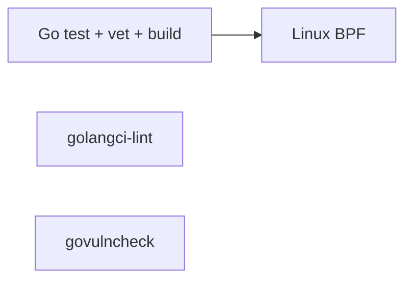

# CI pipeline

## When CI runs

| Event | Branches | Purpose |
|-------|----------|---------|
| `pull_request` | **All** (any head branch → any base) | Every PR gets full CI — no allowlist |
| `push` | **`main` only** | Post-merge validation on default branch |
| `workflow_dispatch` | Manual re-run from Actions tab | |

Feature branches like `phase1/shippable-core` are **not** listed under `push`. Open a PR (or push to `main` after merge) to run CI.

## Jobs



| Job | Runner | Needs root | Typical duration |
|-----|--------|------------|------------------|
| **Go** | `ubuntu-latest` | No | ~2 min |
| **Lint** | `ubuntu-latest` | No | ~3 min |
| **Vulnerability scan** | `ubuntu-latest` | No | ~2 min |
| **Linux BPF** | `ubuntu-latest` | Yes (`sudo`) | ~5–15 min (bpftool cache helps) |

## Local parity

```bash
./scripts/ci-go.sh                    # Go job
./scripts/ci-lint.sh                  # Lint job (do not use mismatched golangci-lint binary)
govulncheck ./...                     # Vuln job
SKIP_APT=1 sudo ./scripts/ci-linux-bpf.sh   # BPF job when apt repos are broken
./scripts/verify.sh                   # Go + BPF on Linux
```

## bpftool on Azure runners

GitHub `ubuntu-latest` kernels (e.g. `6.17.0-1015-azure`) often lack matching `linux-tools-$KVER` packages. CI:

1. Tries kernel-exact apt packages
2. Falls back to building [libbpf/bpftool](https://github.com/libbpf/bpftool) `v7.5.0` under `/tmp`
3. Caches the binary in `runner.tool_cache` for later runs

Never commit `libbpf-*` or `bpftool-src` directories — they are gitignored.

## Dependabot

`.github/dependabot.yml` opens weekly PRs for Go modules and GitHub Actions.
